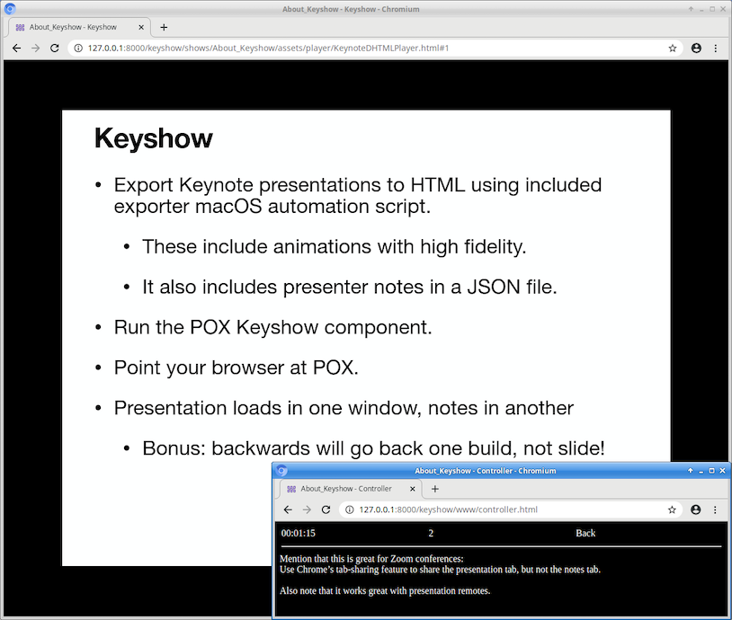

# Keyshow

Keynote is a nice application for making presentations, but it has a pretty
significant annoyance: it can't present in a window.  Fortunately, it can
export presentations as HTML, and these work pretty great -- they have all the
animations and everything.  One thing they don't have, however, is the
presenter notes.

Keyshow is a utility that aims to rectify this.  It lets you open up two web
pages -- one for the presentation itself, and one for the notes.  The notes
window also includes a timer.

Note: Using the notes window to navigate the presentation has a change from the
usual Keynote behavior -- the back button will go back one build step instead
of one slide.  This has always driven me crazy about Keynote.  It could easily
be made configurable.

Note: Keyshow is a very quick hack and has some known and unknown bugs.  In
terms of known ones, the big one is that notes won't initially show up until
you switch slides.  Which isn't that big of a deal.  Just go forward and then
backwards if you have notes on your first slide.  Or fix it and submit a PR. :)

## Uses

The motivating use case for Keyshow was being able to use Chrome's tab sharing
feature with Zoom to share the presentation while having notes available.  But
it could also be used to let someone control a presentation remotely.  You'll
probably want to look into POX's web authentication features for that.

## Installation

The first thing you need to do is run the included `keyshow_export.scpt`
script.  This will ask you for a Keynote presentation, and it'll export it in
HTML along side the original presentation.  This does the same thing as the
Export menu does, except that it includes the presenter nodes in a .json file.

Keyshow is a [POX](https://github.com/MurphyMc/pox) component, so the first
step is to clone pox.  Switch to the `gar` branch or later.  Clone keyshow
into POX's `ext` directory.  Now copy your exported presentations into the
`shows` directory in there.

## Running Presentations

Launch pox with `./pox.py web keyshow`.

Open a web browser to `http://127.0.0.1:8000/keyshow`.  You should see a list
of shows.  Open the controller in one window using the provided link.  Then open
a presentation in another window.  Select the controller window.  Keys,
presentation remotes, and mouse clicks should control the presentation.

You can click the timer to pause it or double click it to reset it.  It will
unpause when you advance the presentation.
